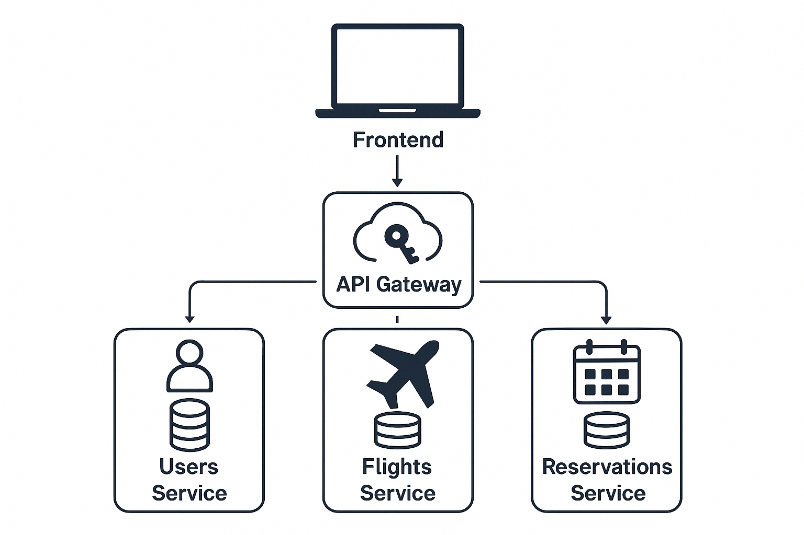

# ✈️ Flight Reservation System - Microservices Architecture

Este proyecto es una aplicación completa de reservas de vuelos construida con arquitectura de microservicios utilizando FastAPI. Los usuarios pueden buscar vuelos, realizar reservas, gestionar su cuenta y consultar información a través de un API Gateway que centraliza las operaciones y maneja la autenticación.

## 🔧 Tecnologías utilizadas

- Python 3.10+
- FastAPI
- SQLite (se puede migrar fácilmente a PostgreSQL o MySQL)
- SQLAlchemy
- Pydantic v2
- JWT para autenticación
- Docker y Docker Compose
- Pytest para testing
- requests para comunicación entre microservicios
- Swagger/OpenAPI para documentación de endpoints

## 📦 Estructura del Proyecto

Cada microservicio está contenido en su propia carpeta dentro de services/, con su propio Dockerfile, tests y configuración independiente.

## 🧩 Arquitectura del Sistema

El sistema está compuesto por 4 servicios:

1. 🧑‍💼 Users Service (Puerto 8005):
   - Registro e inicio de sesión de usuarios
   - Generación y validación de tokens JWT
   - Expone un endpoint `/verify-token` usado por el gateway para autenticar

2. 🛫 Flights Service (Puerto 8006):
   - Administración de vuelos (incluye aviones y ubicaciones normalizadas)
   - Búsqueda de vuelos por origen, destino y fecha

3. 📄 Reservations Service (Puerto 8007):
   - Crea reservas de vuelos
   - Verifica la disponibilidad de asientos comunicándose con Flights Service
   - Permite cancelar y consultar reservas

4. 🌐 API Gateway (Puerto 8000):
   - Redirige tráfico a los microservicios internos
   - Maneja autenticación (con `/verify-token` del users service)
   - Centraliza todos los endpoints públicos

## 🖼️ Diagrama de Arquitectura



> Este diagrama representa la comunicación entre servicios y el gateway. Solo el gateway está expuesto al cliente.

## 🚀 Instalación y ejecución con Docker

1. Clona el repositorio:

```bash
git clone https://github.com/crisboleda/flight-reservation-system.git
cd flight-reservation-system
```

2. Ejecuta todos los servicios con Docker Compose:

```bash
docker-compose up --build
```

3. El sistema quedará expuesto en:

- Gateway: http://localhost:8004
- Users: http://localhost:8005
- Flights: http://localhost:8006
- Reservations: http://localhost:8007

## 🧪 Ejecución de pruebas

Cada microservicio incluye tests unitarios con Pytest.
Desde la raíz del microservicio, ejecuta:

```bash
cd services/users
pytest

cd services/flights
pytest

cd services/reservations
pytest
```

## 📚 Documentación interactiva (Swagger)
Cada microservicio expone su documentación automáticamente:

Users: http://localhost:8005/docs

Flights: http://localhost:8006/docs

Reservations: http://localhost:8007/docs

Gateway: http://localhost:8004/docs

## 📄 Licencia
Este proyecto está licenciado bajo la licencia MIT.
